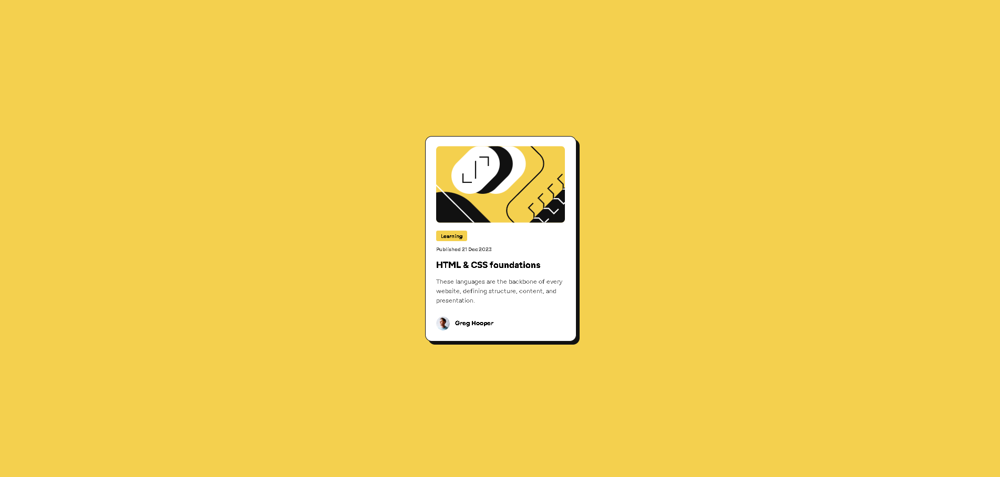

# Frontend Mentor - Blog preview card solution

This is a solution to the [Blog preview card challenge on Frontend Mentor](https://www.frontendmentor.io/challenges/blog-preview-card-ckPaj01IcS). Frontend Mentor challenges help you improve your coding skills by building realistic projects.

## Table of contents

- [Overview](#overview)
  - [The challenge](#the-challenge)
  - [Screenshot](#screenshot)
  - [Links](#links)
- [My process](#my-process)
  - [Built with](#built-with)
  - [What I learned](#what-i-learned)
  - [Continued development](#continued-development)
  - [Useful resources](#useful-resources)
  - [AI Collaboration](#ai-collaboration)
- [Author](#author)

**Note: Delete this note and update the table of contents based on what sections you keep.**

## Overview

### The challenge

Users should be able to:

- See hover and focus states for all interactive elements on the page

### Screenshot



### Links

- Solution URL: [Github Repositery](https://github.com/dawudasasfeh/Blog-preview-card)
- Live Site URL: [Blog preview card](https://blog-preview-card-blush-mu.vercel.app/)

## My process

### Built with

- Semantic HTML5 markup
- CSS custom properties
- Flexbox

### What I learned

In this project, I improved my understanding of:

- Responsive web design for images.
- Using AI tools (Gemini, Google AI, and GitHub Copilot) for guidance while learning.

```css
.card-image-container {
  width: 100%;
  margin-top: 24px;
  border-radius: 10px;
  overflow: hidden;
}
.card-image {
  display: block;
  width: 100%;
  height: 200px;
  object-fit: cover;
  object-position: center;
}

@media (min-width: 768px) {
  .card {
    max-width: 384px;
  }
  .card-image {
    height: auto;
    object-fit: fill;
  }
}
```

### Continued development

My next step is learning React and continuing to build small projects to gain more hands-on experience, just like I did with this challenge.

### Useful resources

- [Responsive Web Design - Images](https://www.w3schools.com/css/css_rwd_images.asp) - This resource helped me better understand responsive images, and I plan to apply this approach in future projects.

### AI Collaboration

I used Gemini, Google AI, and GitHub Copilot for guidance on responsive web design images.

## Author

- Website - [Dawudasasfeh](#)
- Frontend Mentor - [@dawudasasfeh](https://www.frontendmentor.io/profile/dawudasasfeh)
